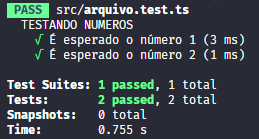

Bora documentar os testes

# install
```node
npm i jest -D
```

Para typescript
```node
npm i jest ts-jest @types/jest -D
```

# init
Inicialização da forma convencional
```node
npx jest --init
```

Inicialização de forma rápida
```node
npx ts-jest config:init
```

# Executar testes
Para realizar os testes na aplicação, utilize os comando:

`npx jest`

Esse comando vai procurar todos os arquivos que tiverem \*.teste.\* ou \*.spec.\* e checar os testes contidos dentro destes arquivos.

## Configurando o vscode

Dentro do arquivo package.json nas chaves de scripts, coloque o seguinte código:

```json
"script": {
	"test": "jest",
	"test:silent": "jest --watchAll --silent --noStackTrace" 
}
```

# Escrevendo testes
Primeiramente é necessário ter um arquivo com a nomemclatura certa para os testes, logo é necessário ter `.spec` ou `.test` no nome

Geralmente `.spec` é utilizando para teste de integração e `.test` para testes unitários. Mas isso pode mudar de acordo com o time que você trabalha.

## it/test
Dentro dos arquivos de teste, você pode utilizar as funções `it` ou `test` que fazem a mesma coisa. Ambas recebem uma descrição e uma função que contera o teste.

exemplo:

`arquivo.test.ts`

```ts
// Ambas funções fazem a mesa coisa

it('Precisa retornar 1', () => {
	const numero = 1;

	expect(numero).toBe(1);
})

test('Precisa retornar 1', () => {
	const numero = 1;

	expect(numero).toBe(1);
})
```

## describe
Você pode organizar melhor seus teste, dando a eles uma descrição. Logo desta forma fica mais fácil de saber de o teste vem.

> Utilize describe de maneira a criar grupos de testes que sejam coesos entre si. Logo fica´ra mais fácil de encontrar seus testes caso algum venha a falhar.

exemplo:
`arquivo.test.ts`
```ts
describe('TESTANDO NUMEROS', () => {
	it('É esperado o número 1', () => {
		const numero = 1;
		expect(numero).toBe(1);
	})

	it('É esperado o número 2', () => {
		const numero = 2;
		expect(numero).toBe(2);
	})
})
```

Exemplo de sáida:




# Asserções

Exemplos de algumas asserções que podem existir. Lembrando que existem muitas! Então é mais viavél checar a documentação caso haja dúvidas


