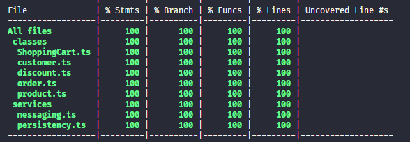
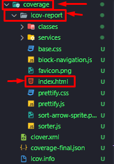
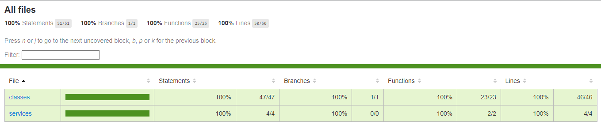

Notas básicas de estudos em jest.

- [install](#install)
- [init](#init)
- [Executar testes](#executar-testes)
	- [Configurando o vscode](#configurando-o-vscode)
- [Escrevendo testes](#escrevendo-testes)
	- [it/test](#ittest)
	- [describe](#describe)
- [Asserções](#asserções)
- [Criando sut para diversas classes que tenham a mesma interface - System under test](#criando-sut-para-diversas-classes-que-tenham-a-mesma-interface---system-under-test)
- [Mocks](#mocks)
- [spyOn](#spyon)
	- [Simulando retornos](#simulando-retornos)
- [Limpando os mocks a cada chamada](#limpando-os-mocks-a-cada-chamada)
- [Coverage](#coverage)

Parte dos códigos estão em inglês, força do habito...

# install
```node
npm i jest -D
```

Para typescript
```node
npm i jest ts-jest @types/jest -D
```

# init
Inicialização da forma convencional
```node
npx jest --init
```

Inicialização de forma rápida
```node
npx ts-jest config:init
```

# Executar testes
Para realizar os testes na aplicação, utilize os comando:

`npx jest`

Esse comando vai procurar todos os arquivos que tiverem \*.teste.\* ou \*.spec.\* e checar os testes contidos dentro destes arquivos.

## Configurando o vscode

Dentro do arquivo package.json nas chaves de scripts, coloque o seguinte código:

```json
"script": {
	"test": "jest",
	"test:silent": "jest --watchAll --silent --noStackTrace" ,
	"test:coverage": "jest --coverage --silent --noStackTrace"
}
```

# Escrevendo testes
Primeiramente é necessário ter um arquivo com a nomemclatura certa para os testes, logo é necessário ter `.spec` ou `.test` no nome

Geralmente `.spec` é utilizando para teste de integração e `.test` para testes unitários. Mas isso pode mudar de acordo com o time que você trabalha.

## it/test
Dentro dos arquivos de teste, você pode utilizar as funções `it` ou `test` que fazem a mesma coisa. Ambas recebem uma descrição e uma função que contera o teste.

exemplo:

`arquivo.test.ts`

```ts
// Ambas funções fazem a mesa coisa

it('Precisa retornar 1', () => {
	const numero = 1;

	expect(numero).toBe(1);
})

test('Precisa retornar 1', () => {
	const numero = 1;

	expect(numero).toBe(1);
})
```

## describe
Você pode organizar melhor seus teste, dando a eles uma descrição. Logo desta forma fica mais fácil de saber de o teste vem.

> Utilize describe de maneira a criar grupos de testes que sejam coesos entre si. Logo fica´ra mais fácil de encontrar seus testes caso algum venha a falhar.

exemplo:
`arquivo.test.ts`
```ts
describe('TESTANDO NUMEROS', () => {
	it('É esperado o número 1', () => {
		const numero = 1;
		expect(numero).toBe(1);
	})

	it('É esperado o número 2', () => {
		const numero = 2;
		expect(numero).toBe(2);
	})
})
```

Exemplo de sáida:


# Asserções

Exemplos de algumas asserções que podem existir. Lembrando que existem muitas! Então é mais viavél checar a documentação caso haja dúvidas

```ts
it('Exemplo de asserções de números', () => {
	const number = 10;

	expect(number).toBe(10);
	expect(number).toEqual(10);
	expect(number).not.toBeFalsy();
	expect(number).toBeTruthy();
	expect(number).toBeGreaterThan(9);
	expect(number).toBeGreaterThanOrEqual(10);
	expect(number).toBeLessThan(11);
	expect(number).toBeLessThanOrEqual(10);
	expect(number).toBeCloseTo(10.001);
	expect(number).not.toBeNull();
	expect(number).toHaveProperty('toString');
})

it('Exemplo de asserções de objetos', () => {
	const pessoa = { nome: 'Albert', sobrenome: 'Einstein' };
	const outraPessoa = { ...pessoa };

	expect(pessoa).tobeEqual(outraPessoa);
	expect(pessoa).toHaveProperty('nome');
	expect(pessoa).not.toHaveProperty('idade');
	expect(pessoa).toHaveProperty('nome', 'Albert');
	expect(pessoa.nome).toBe('Albert');
})
```
# Criando sut para diversas classes que tenham a mesma interface - System under test

Caso você tenha aplicado interfaces especificas para suas classes, mas sim uma interface genérica que serviu para diversas classes. Isso pode complicar seus testes, pois agora teria que criar vários mocks especificos para cada classe.

Mas com o código abaixo, fica bem adaptativo

```ts
import ExempleClass from './class'

const createSut = (className: new () => InterfaceName) => InterfaceName => {
	return new className()
}

it('Exemplo', () => {
	const sut = createSut(ExempleClass);
	//...
})
```


# Mocks

Muitas vezes não é necessário testar realmente classes, para isso existe os mocks, que serve para simular coisas. Assim podemos criar uma classe fake, implementando sua interface.

Dessa forma podemos fazer testes de integração com maior velocidade, e deixar os testes unitários darem cabo nas validações dos métodos das classes.

Exemplo

```ts
const ExempleMock implements ExempleProtocol {
	// reescreva os métodos somente para implementalos
	// Você poderá simular retornos diretamente nas suas chamadas
}

const createSut = () => {
	const exampleMock = new ExempleMock();
	const classNeededExample = new ClassNeededExample(exampleMock);
	return classNeededExample;
}
```

# spyOn

Você pode colocar o jest para observar oque deseja, dessa maneira é possível saber se métodos foram chamados e muito mais.

exemplo

```ts
interface FlyingMechanism {
	releaseWings(): void;
	propulsion(): void;
}

class FlyingCar {
	constructor(private readonly flyngMechanism: FlyingMechanism){}

	startFlight() : void {
		this.flyngMechanism.releaseWings()
		this.flyngMechanism.propulsion()
	}
}

class FlyingMechanismMock implements FlyingMechanism{
	releaseWings(): void;
	propulsion(): void;
}

const createSut = () => {
	const flingMechanismMock = new FlyingMechanismMock()
	const sut = new FlyingCar(flingMechanismMock)
	return { sut , flingMechanismMock }
}

it('Flying car should be fly', () => {
	const { sut, flyingMechanism} = createSut();
	// Espeiando o método propulsion da classe flyingMechanism
	const flyingMechanismSpy = jest.spyOn(flyingMechanism, 'propulsion');
	sut.startFlight();
	expect(flyingMechanismSpy).toHaveBeenCalledTimes(1);
})
```

## Simulando retornos 

Da para simular os retornos dos Mocks, então dessa forma, não importa a maneira que você implementar o método no mock, o retorno será aquele que você quiser. Oque agiliza bastante o processo!

```ts
interface FlyingMechanism {
	releaseWings(): void;
	propulsion(): void;
}

class FlyingCar {
	constructor(private readonly flyngMechanism: FlyingMechanism){}

	startFlight() : void {
		this.flyngMechanism.releaseWings()
		this.flyngMechanism.propulsion()
	}
}

class FlyingMechanismMock implements FlyingMechanism{
	releaseWings(): void;
	propulsion(): void;
}

const createSut = () => {
	const flingMechanismMock = new FlyingMechanismMock()
	const sut = new FlyingCar(flingMechanismMock)
	return { sut , flingMechanismMock }
}

it('Flying car should be fly', () => {
	const { sut, flyingMechanism} = createSut();
	//Simulando o retorno
	const flyingMechanismSpy = jest.spyOn(flyingMechanism, 'propulsion')
		.mockReturnValue(true);;
	sut.startFlight();
	expect(flyingMechanismSpy).toBeTruthy();
})
```

# Limpando os mocks a cada chamada

Em alguns casos que você queira fazer testes de integração e validar chamadas de métodos, é necessário limpar os mocks a cada chamada de teste, pois se não a contagem da chamada do método que você deseja, estará errada

exemplo

```ts
describe('Exemplo', () => {
	// Isso limpa os mocks a cada chamada
	afterEach(() => { jest.clearAllMocks()})

	//Testes aqui para baixo
} )
```

# Coverage

Utilizado para checar a cobertura de testes no seu código. Ele valida se cada cantinho do código passou pelo menos por 1 teste. Dessa maneira é possivél validar se seus testes estão rodando em todo o programa ou somente e parte dele.

comando:
```node
npx jest --coverage
npx jest --coverage --silent --noStackTrace
```
Exemplo de sáida:



Ele também cria uma pasta em seu projeto, que permitem ter uma visualização web.



Exemplo da página web.




